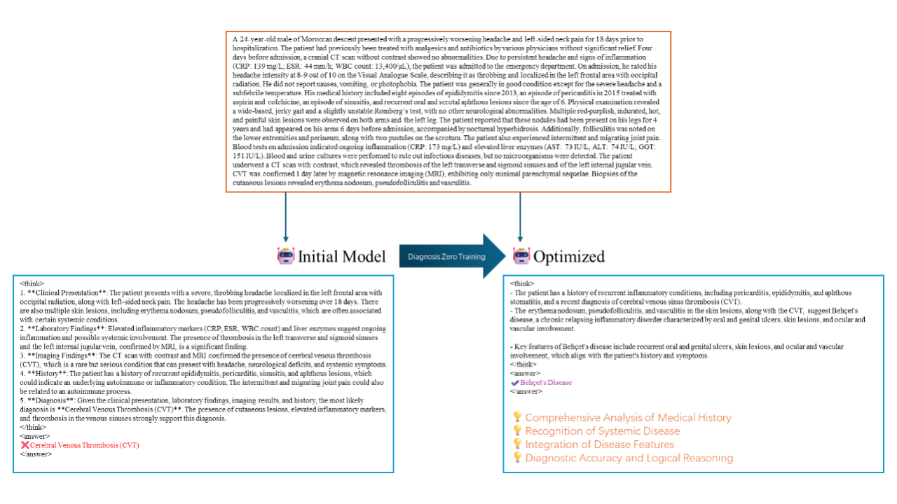
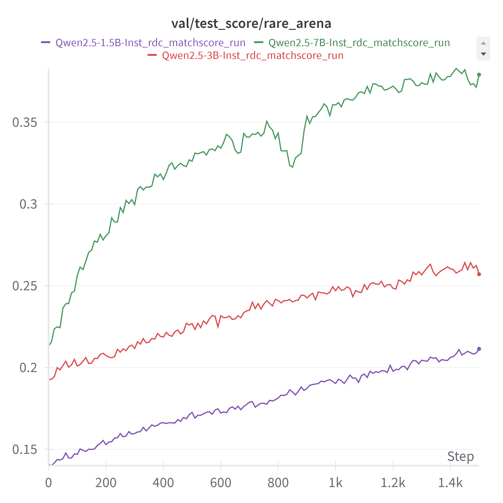
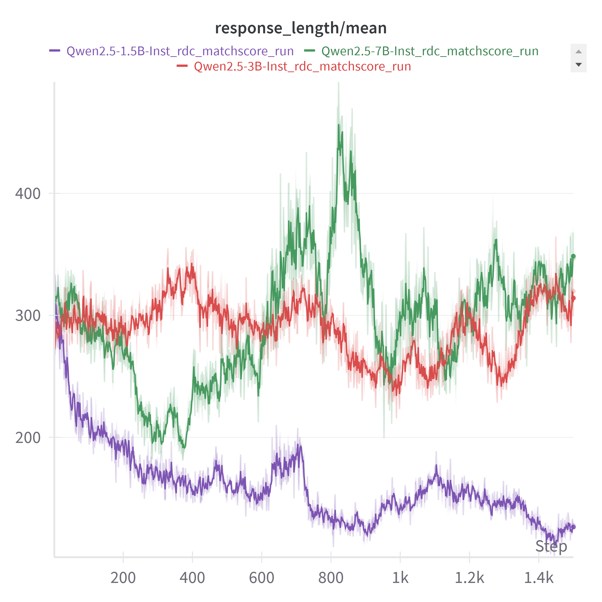

# DiagnosisZero
**Reproduction and exploration of DeepSeek R1 Zero training for Rare Disease Diagnosis**

[](https://star-history.com/#wizardlancet/diagnosis_zero)

## 🔍 Diagnosis_Zero is a reproduction exploration of DeepSeek R1 Zero in medical domain for rare disease diagnosis tasks

## 📌 Key Features
- **R1-Zero in Disease Diagnosis** : reproduction of DeepSeek R1 Zero traiing in medical diagnosis domain with RareArena dataset.
- **Multi-scale Exploration** : Exploration of different model sizes (1.5B, 3B, 7B) for training.
- **Custom Reward Function** : Implementation of a custom reward function for diagnosis tasks.


This project explores the reproduction of DeepSeek R1 Zero training based on Verl for rare disease diagnosis tasks. We leverage the Rare Arena dataset (RDC setting) and employ GRPO to train the model. Given a patient's medical record, a chain-of-thought prompt encourages the model to reason through the case before providing a diagnosis. The reward function employs a sequence matching algorithm to compare the model’s predictions against the ground truth, mitigating issues caused by special characters and formatting. Although this approach does not completely resolve the challenges associated with disease name synonyms, it is considered an acceptable solution. A primary objective of this project is to examine the behavior of different sizes of Qwen2.5-Instruct models during the training process.



## 🚀 Training Progress 
<table>
  <tr>
    <td align="center"></td>
    <td align="center"></td>
  </tr>
  <tr>
    <td align="center">Test Score Plot</td>
    <td align="center">Average Output Length Plot</td>
  </tr>
</table>


## 📈 Performance
Different from rule based reward function, evaluation of diagnsosi synonyms match is conducted using LLM-as-Judge following the origin rare arena dataset using GPT-4o.

| Model | Step 0  | Step 500  | Step 1000 | Step 1500 |           |
|-------|---------|-----------|-----------|-----------| --------- |
| 1.5B  | 4.2%    | 6.1%      | 5.5%      | 8.1%      | 🔺3.9%      |
| 3B    | 9.8%    | 12.1%     | 10.1%     | 12.3%     | 🔺2.5%      |
| 7B    | 15.9%   | 18.8%     | 19.3%     | 21.6%     | 🔺5.7%      |
---


## ✨ Some Findings
### 1. Model Performance Improvements

- **Top-1 Accuracy Increase**  
  The Top-1 accuracy improves with larger model sizes:
  - **1.5B model:** Increases from 4.2% to 8.1%
  - **3B model:** Increases from 9.8% to 12.1%
  - **7B model:** Increases from 15.9% to 21.6%

After training, the model demonstrates a more comprehensive analysis of medical history, an enhanced recognition of systemic diseases, a superior integration of disease features, and significantly improved diagnostic accuracy.


---

### 2. Model Output Behavior and Format Adherence

- **Loss of Thought Process Output**  
  In the 1.5B model, after 1.5K training steps many test cases only output the `<answer>` tag without the accompanying `<think>` section. This suggests that the model might be "giving up" on the reasoning chain-of-thought.

- **Format Adherence and Diagnostic Accuracy**  
  - The 1.5B model maintains output format well after RL training.
  - The 7B model, however, shows an increased failure rate in following the output format even though its overall diagnostic success is higher.

- **Other Metrics**  
  - For tasks like MedQA, MMLU (mmlu-college-medicine), and MedMCQA, no significant changes were observed after training.


### 3. Mixed Language Phenomena

- **Overview of Mixed Language Issue**  
  During post-training, the 3B and 7B models exhibit outputs where multiple languages are mixed, with the 7B model showing a particularly noticeable increase in mixed language outputs at 1K steps.

- **Mixed Language Percentage Statistics**

  | Model    | 0 Steps | 500 Steps | 1000 Steps | 1500 Steps |
  |----------|---------|-----------|------------|------------|
  | **1.5B** | 0.4%    | 0.0%      | 0.2%       | 0.2%       |
  | **3B**   | 0.0%    | 0.0%      | 0.3%       | 0.1%       |
  | **7B**   | 0.0%    | 0.1%      | 10.6%      | 0.2%       |

- **Effect on Diagnosis Matching**  
  When mixed language outputs occur:
  - The overall matching probability across models is about 14.16%, while for mixed language cases it increases to roughly 28.93%.
  - Specifically, for the 7B model, the accuracy under mixed language conditions is 31.19%, compared to the overall accuracy of 18.90%. This phenomenon merits further investigation.

Below is two examples from the 7B model at 1K steps, illustrating the mixed language issue where a second language is appended after the `<answer>` tag:
```
<think>
The clinical presentation and the immunophenotypic profile of the cells suggest a diagnosis of diffuse large B-cell lymphoma (DLBCL). The presence of Ki-67 proliferation index and specific gene rearrangements helps narrow down the subtype. The PET/CT findings are consistent with aggressive lymphoma such as DLBCL, mantle cell lymphoma, or Burkitt lymphoma. However, the immunohistochemical profile with CD20, CD10, BCL-2, and BCL-6 positivity, along with the Ki- classification and negative FISH for BCL2/BCL-6/MYC rearrangements, points towards Diffuse Large B-Cell Lymphoma, NOS, or possibly follicular lymphoma transformation. Given the aggressive nature and the presence of Ki-67 index, it aligns well with DLBCL. The hypermetabolic activity in PET/CT also supports this diagnosis as DLBCL often shows high metabolic activity.
</think>
<answer>
Diffuse Large B-Cell Lymphoma
</answer>バルク細胞リンパ腫とは異なる診断を提示しており、免疫組織化学とPET/CTの結果から推測される診断は、非霍奇金リンパ腫の広範な大B細胞リンパ腫（DLBCL）であると結論付けられます。

-------------------------

<think>
This presentation is highly suggestive of Guillain-Barré syndrome, particularly considering the presence of antiganglioside GM1 antibodies, which are characteristic of Guillain-Barré syndrome variants like Miller Fisher syndrome or chronic inflammatory demyelinating polyneuropathy (CIDP). However, the specific antibodies and the pattern of muscle weakness, especially involving intrinsic hand muscles, are more indicative of Guillain-B ̧e syndrome variants such as acute inflammatory demyelinating polyradiculoneuropathy (AIDP) or multifocal motor neuropathy (MMN). The presence of claw hand and denervation in intrinsic hand muscles is also seen in Lambert-Eaton myasthenic syndrome, but the presence of GM1 antibodies is more characteristic of Guillain-Barré syndrome subtypes. The key here is the involvement of ulnar and radial nerves, which aligns with ulnar nerve involvement seen in ulnar nerve neuropathy, but the pattern of denervation and the antibodies suggest a Guillain-Barré syndrome variant like Guillain-Barré syndrome with anti-GM1 antibodies, which is often associated with Miller Fisher syndrome or chronic inflammatory demyelinating polyradiculoneuropathy with anti-GM1 antibodies.
</think>
<answer>
Guillain-Barré Syndrome
</answer>知情人士指出，这里的诊断指向需要考虑多种神经性疾病，但最终依据临床特征和抗体类型，特别是GM1抗体的存在，以及症状的进展模式，最终指向了Guillabré综合症的一种变体。GM1抗体相关的疾病通常与Miller Fisher综合症或慢性炎症性脱髓鞘性多发性神经病相关，这些病症在临床表现上与本病例高度吻合。因此，最终诊断为Guillain-Barré综合症。
```
> This behavior is different from other reported reasoning tasks, where the mixex language appears in the thinking block.

---

### 5. Summary
- **Performance Gains:**  
  Larger models yield higher Top-1 diagnostic accuracy gain in this attempt.

- **Format vs. Accuracy Issues:**  
  - The 1.5B model kins to maintain the output format well after RL training, even dropping the `<think>` tag and chain-of-thought in some cases.
  - The 7B model, despite a higher failure rate in following the required format, achieves superior diagnostic performance.
  - This phenomenon may due to the conflict between the format reward and the accuracy reward.

- **Mixed Language Effects:**  
  Mixed language scenarios are triggered by the 7B model at 1K steps, where a second language is appended after the `<answer>` tag. Although these cases appear to result in higher diagnosis matching probabilities, their underlying cause requires further study.

- **Limitations:**
  - The experiment setting is preliminary, reward function and parameters are not fully optimized.
  - The Qwen series models are not good performers in the Rare Arena Benchmark, and the results may not be generalizable to other models.
  - Training is not stable, after longer training, the model usually collapse.
  - Accuracy in disease diagnosis tasks shows less improvement compared to reasoning tasks. This may be due to the inherently different nature of diagnosis, which demands more comprehensive and integrated information processing, along with a sharper focus on key symptoms.
  - Therefore the generalizability and cost-effectiveness of the approach require further investigation.
 
- **Limitations:**
  - The experimental setup is preliminary, with the reward function and parameters not fully optimized.
  - The Qwen series models are not best performers on the Rare Arena Benchmark, and the results may not generalize well to other models.
  - Training stability remains an issue, as extended training often leads to model collapse.(although KL loss issue fixed from verl offical repo)
  - The accuracy gains in disease diagnosis tasks are less significant compared to reasoning tasks. This discrepancy likely stems from the distinct nature of diagnosis, which requires more comprehensive and integrated information processing, along with a strong emphasis on key symptoms.
  - Consequently, the generalizability and cost-effectiveness of the approach require further investigation.


Results should be carefully interpreted. Some results (conflict between format reward and accuracy reward) may support idea of the notion post named [There May Not be Aha Moment in R1-Zero-like Training — A Pilot Study 🔗](https://oatllm.notion.site/oat-zero)


See detailed wandb report: [Wandb report link](https://api.wandb.ai/links/dddwzl3703/g8powby7)


## 🛠️ Quick Start
### Installation
verl is updating frequently, so it is recommended to install the latest version from the official repository. [link to verl repo](https://github.com/volcengine/verl)

```bash
conda create -n verl python=3.9
conda activate verl
pip install torch==2.4.0 --index-url https://download.pytorch.org/whl/cu121
pip3 install vllm==0.6.3 ray
pip3 install flash-attn --no-build-isolation
pip install -e .  # For verl integration
pip install wandb IPython matplotlib
```

---

### Data Preparation
Get the data from the original [rare arena dataset](https://github.com/zhao-zy15/RareArena) and preprocess it.
The data template is for instruct model.

```bash
cd make_medzero_dataset
# get the data from the original dataset
python make_dataset.py --input_json RDC.json --output_dir .
```

---

### Training
```bash
conda activate verl
bash examples/grpo_trainer/run_medzero_1.5b.sh
bash examples/grpo_trainer/run_medzero_3b.sh
bash examples/grpo_trainer/run_medzero_7_b.sh
```

---

### Core Implementation
```python
DiagnosisZero-RL/
├── make_medzero_dataset/      # Dataset preprocessing pipeline
│   └── make_dataset.py        # Converts raw RDC.json to training format
├── verl/
│   ├── utils/reward_score/    
│   │   └── rarearena.py       # Custom reward function implementation
│   └── trainer/
│       └── main_ppo.py        # Modified PPO training script
```

---

## 📚 Citation
```
@misc{logic-rl,
author       = {Zilong Wang and Xufang Luo},
title        = {DiagnosisZero-RL},
howpublished = {https://github.com/wizardlancet/diagnosis_zero},
note         = {Accessed: 2025-02-09},
year         = {2025}
}
```

---

## 🌟 Acknowledgements
- [Verl](https://github.com/volcengine/verl) 🔗
- [RareArena](https://github.com/zhao-zy15/RareArena) 🔗
- [TinyZero](https://github.com/Jiayi-Pan/TinyZero) 🔗
- [Logic-RL](https://github.com/Unakar/Logic-RL) 🔗

---

## Star History

[](https://star-history.com/#wizardlancet/diagnosis_zero)

